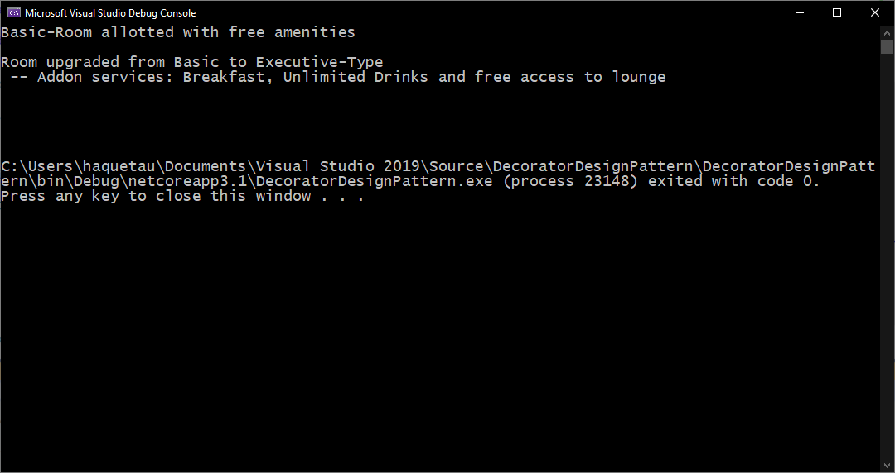

# Decorator Design Pattern in C#
A NET Core C# console application to implement the Decorator Design Pattern using a simple example.

## Requirement Description

Let us assume we have a very simple hotel room booking application. The application is currently capable of only booking a Basic room type and this class has been marked sealed and cannot be extended.

Now there is a requirement that the hotel has introduced a new Executive Room type with few facilities and wants an option to upgrade the room based on the customer requirement. Let us implement this requirement.

## Application output

The details about Decorator Design Pattern and details about the application can be found at the following blog: https://executecommands.com/decorator-design-pattern-csharp-simple-example/
